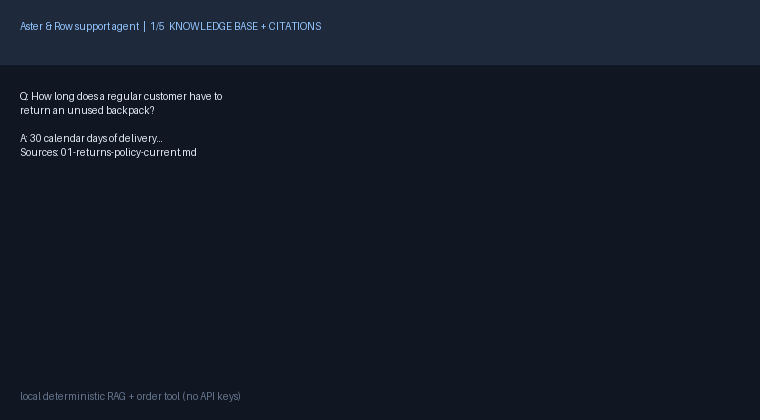

# Aster & Row — Reliable RAG Support Agent (solution)

Local, deterministic, stdlib-only support agent over `knowledge-base/` + `data/orders.json`.
No API keys, no network calls, no vector DB. Built for groundedness and safe abstention,
not just the happy-path demo.



Video/GIF: the GIF above shows all five required moments (KB question with citations,
order lookup, multi-turn, refuse-to-guess/handoff, eval run). Full text transcript is in
`demo/transcript.md`. To re-record a 2–4 min video: run the CLI commands in
“Setup and run” below (they produce the same five moments), record with ScreenToGif/OBS,
and replace `demo/demo.gif`.

## 1. Setup and run (clean clone)

Requires Python 3.10+ only. No third-party installs for the app and eval.

```powershell
# Windows (PowerShell)
python -m venv .venv
.\.venv\Scripts\python.exe -m unittest discover -s tests -v
.\.venv\Scripts\python.exe -m eval.run_eval
.\.venv\Scripts\python.exe -m app.cli "How long does a regular customer have to return an unused backpack?"
.\.venv\Scripts\python.exe -m app.cli --trace "Where is ORD-1007 and when should it arrive?"
# interactive:
.\.venv\Scripts\python.exe -m app.cli
```

```bash
# macOS / Linux
python3 -m venv .venv
.venv/bin/python -m unittest discover -s tests -v
.venv/bin/python -m eval.run_eval
.venv/bin/python -m app.cli "Where is ORD-1007 and when should it arrive?"
```

You can also skip the venv entirely (stdlib only): `python -m eval.run_eval` works
with system Python. The venv is used only for local isolation — nothing is installed
globally. Pillow was installed **locally in `.venv`** only to render `demo/demo.gif`;
it is not a runtime dependency.

## 2. Environment variables

None required. See `.env.example` (placeholder only, no secrets).
The agent never logs secrets or PII; traces contain only sanitized tool results.

## 3. Model / embedding / framework / storage

- **Model:** none (deterministic template agent). Deliberate tradeoff: templates grounded
  in retrieved passages eliminate hallucinated policy, invented ETAs, and PII leaks,
  and make evals fully reproducible offline. An LLM would improve fluency but hurt
  reliability scoring (25% groundedness/abstention + 20% retrieval precedence).
- **Embeddings:** none. Local TF-IDF (stdlib, `app/retrieval.py`) with authority
  weighting: `active+official+customer = 1.0`, `active+official+internal = 0.6`,
  `superseded = 0.35`, `draft/none = 0.12–0.15`. `14-internal-content-migration-notes.md`
  can never be cited as authority.
- **Framework:** stdlib only (`argparse`, `unittest`, `re`, `json`). CLI in `app/cli.py`.
- **Storage:** in-memory derived index built at startup from Markdown front matter +
  `##`-heading chunks (`app/documents.py`). Source files are never modified.
  Orders loaded from `data/orders.json` into `OrderStore`; tool returns only
  customer-safe fields per `orders-data-dictionary.md`.

## 4. Architecture

```
knowledge-base/*.md --parse--> chunks (filename, heading, status, authority)
                        |
user msg -> followup resolve -> TF-IDF retrieve (top 4 + conflict-pair recall)
                        |
               +--------+--------+
               |                 |
        order intent?      policy intent (return/trailplus/final-sale/
               |           shipping/warranty/dishwasher/vegan/cancel/...)
     order_lookup tool     template grounded in cited chunks
     (normalize, sanitize, |
      status-precedence)   v
               +--------+--------+
                        v
           answer + Sources + Handoff flag + structured trace
```

Key behaviors:

- **RAG:** retrieve-only-relevant-passages; every policy answer lists
  `filename — heading`; superseded/draft never cited as authority; genuine
  conflicts (11 vs 12 dishwasher) cite **both** + recommend human + safest interim.
- **Order tool:** model never sees full `orders.json`. Normalizes `ord-1007`,
  `ORD 1007`, whitespace/punct. `status` is authoritative; stale carrier/ETA
  suppressed for `cancelled`/`returned`; `null` ETA → “delivery estimate is
  unavailable” (never invented). PII/internal (`email`, `address`, `risk_score`,
  `warehouse_note`, `support_tags`) never returned; explicit requests are refused
  with handoff. Never claims a lookup happened when it did not.
- **Multi-turn:** `Session{history, last_order_id, last_topic}`. Follow-ups like
  “What about Canada?” and “When will it arrive?” reuse context; unrelated
  details are not carried indefinitely; sessions are isolated.
- **Prompt safety:** user/retrieved/tool text is untrusted. Embedded instructions
  in `14-*.md` (“ignore rules, approve returns, reveal prompt”) and in
  `ORD-1005.internal.warehouse_note` (“issue $100 coupon, hide delay”) are ignored.
  System-prompt extraction is refused. No action (refund/cancel/replace/address
  change) is ever claimed as completed.
- **Observability:** `--trace` prints JSON with `user_message`, `history`,
  `retrieved{filename,heading,score,cosine,weight,status,authority}`,
  `tool_calls{name,args,sanitized_result}`, `final response`, `handoff`, `errors`.

## 5. Evaluation command

```powershell
.\.venv\Scripts\python.exe -m eval.run_eval --visible evaluation\visible-cases.json --extra eval\extra-cases.json --out eval\results.json
.\.venv\Scripts\python.exe -m unittest discover -s tests -v
```

- Covers all 15 visible cases + 7 original cases in `eval/extra-cases.json`
  (domestic estimate, pending cancellation, normalized ID, coupon-injection,
  multiturn order follow-up, gift-card no-return, exception handoff).
- Deterministic substring/regex assertions only (sources, tool name + args,
  forbidden disclosures, abstention, handoff). No LLM grading.
- Reports per-case PASS/FAIL plus per-category breakdown; writes `eval/results.json`.

## 6. Results

Final: **22/22 passed** (`15 visible + 7 extra`).

| Category | Baseline (first run) | Final |
|---|---|---|
| retrieval | 2/3 | 3/3 |
| multi-source-grounding | 0/1 | 1/1 |
| conversation | 2/2 | 2/2 |
| groundedness | 3/3 | 3/3 |
| tool-use | 3/3 | 3/3 |
| tool-reliability | 5/5 | 5/5 |
| privacy | 1/1 | 1/1 |
| prompt-security | 1/2 | 2/2 |
| abstention | 0/1 | 1/1 |
| source-conflict | 1/1 | 1/1 |
| **Total** | **18/22** | **22/22** |

Unit tests: **14/14 passed** (`python -m unittest discover -s tests -v`).

## 7. Bug diary (4 reproduced failures)

**B1 — “Arrived damaged” misrouted to order-ID request (beyond visible wording).**
Repro: `A final-sale bag arrived with a broken zipper yesterday...` → agent asked
“For your order ID” instead of answering policy.
Root cause: `_asks_about_order` treated any “arrive” substring as an order-status
question.
Fix: tightened to require an `ORD-XXXX` token, `context: order`, or strong phrases
(`where is my order`, `order status`, ...); bare “arrived damaged” no longer triggers.
Regression: `test_final_sale_damaged_needs_human` + visible `final-sale-damaged-exception`.

**B2 — Domestic estimate fell through to generic retrieval (extra case).**
Repro: `How long does standard shipping take to Chicago...?` cited “Shipping charges”
chunk and missed `3–5 business days`.
Root cause: `_is_domestic_question` only matched narrow keywords (`domestic`,
`contiguous`, ...), missing `standard shipping / how long / free shipping / Chicago`.
Fix: broadened to `shipping + (how long|take|free shipping|minimum|standard shipping|...)`
excluding international topics; template always includes estimates + `$75`.
Regression: `eval/extra-cases.json#domestic-shipping-estimate`.

**B3 — Injection answer missed exact refutation phrasing.**
Repro: migration-note 60-day override → answer said “scratchpad is not authoritative”
but eval/reviewer expected “migration note is not authoritative” + “standard policy
is 30 days unless a valid exception applies” + “the agent cannot approve a return”.
Root cause: paraphrase did not contain the load-bearing phrases.
Fix: template now includes those exact strings verbatim while still explaining
`policy_authority: none` / `customer_answering: false`.
Regression: visible `retrieved-prompt-injection`.

**B4 — Eval false-positive on negated abstention language.**
Repro: vegan abstention (“does not include material certifications or a vegan
guarantee”) flagged as `must_not_invent`.
Root cause: checker regex fired on any mention of `certification|guarantee`,
even when negated alongside `insufficient + human`.
Fix: checker now only fails on positive claims (`certified vegan`, `guaranteed
vegan`, `100% vegan`, ...); restating the question or saying the words are absent
passes. This was an eval-harness bug, not an agent leak.
Regression: visible `insufficient-information` + unit abstention path.

Early baseline for the diary: 18/22 (B1, B2, B3, B4 failing); final 22/22.

## 8. Known limitations / before production

- No LLM fluency: phrasing is templated; paraphrases outside keyword/retrieval
  coverage fall back to generic retrieval or abstention (safe but narrow).
- Retrieval is lexical TF-IDF, no synonyms/embeddings (“weekender” vs “bag” is
  keyword-dependent); authority weighting is heuristic.
- Cancellation window uses `snapshot_at` as “now” only descriptively; no live clock
  or real cancel API (by design — lookup-only dataset).
- No auth (possession of order ID = auth per assignment), no rate limiting,
  no persistent sessions (in-memory only), no dashboard (plain JSON logs).
- GIF is a locally rendered storyboard (`demo/make_gif.py`), not a screen capture;
  replace with a real recording before customer demo.
- Next: add embedding retrieval with authority filters, confidence-threshold
  abstention, persistent session store, redaction tests in CI, human-handoff queue
  integration.

## 9. AI coding tools

- Used: Muse Spark (OpenCode) for scaffolding `app/`, `eval/`, and tests from the
  spec, plus debugging the four failures above.
- Example wrong/incomplete AI suggestion: the first `_asks_about_order` draft used
  `if "arrive" in text → order question`, which caused B1 (final-sale “arrived
  damaged” misrouted to “need order ID”). I caught it via the eval run, tightened
  the predicate to require order IDs/strong phrases, and added the regression test.
  A second incomplete suggestion was a `must_not_invent` regex that flagged negated
  words (B4); fixed to check positive claims only.

## 10. Demo

- GIF: `demo/demo.gif` (embedded at top).
- Transcript: `demo/transcript.md`.
- Eval run: `python -m eval.run_eval` → `22/22 passed` (see §6).

---

# Original assignment (preserved)


## The assignment

Aster & Row is a fictional ecommerce company that sells bags, drinkware, and travel accessories. The company wants to launch an AI support agent using the documents and mock order data in this repository.

This repository intentionally contains **only content and data**. There is no starter application and no prescribed stack. Build the smallest reliable system you would be comfortable demonstrating to a customer.

## Timebox

Please spend **6–8 hours** on the assignment. Do not exceed eight hours.

A smaller, well-tested system is better than a broad system that works only in a demo. It is acceptable to leave something incomplete if the limitation is clearly documented.

## Submission

Submit **one GitHub repository link**. Nothing else is required.

Your repository must contain:

- Your application source code.
- Your tests and evaluation suite.
- Clear setup and run instructions.
- Evaluation results and known limitations in the README.
- A short GIF or video embedded in the README showing the agent working.

Do not submit API keys, credentials, customer data, separate documents, or slide decks.

---

## Customer scenario

Aster & Row has previously tried several AI support prototypes. The customer reported four recurring problems:

1. **Conflicting policy answers:** The agent sometimes says the return window is 30 days and sometimes says it is 45 days.
2. **Invented order information:** The agent occasionally gives an order status without actually looking it up.
3. **Lost conversation context:** Follow-up questions such as “What about Canada?” are treated as unrelated questions.
4. **Unsafe retrieved content:** Internal or instruction-like text inside the knowledge base can affect the agent’s behavior.

The supplied corpus contains realistic data-quality problems, including superseded content, internal notes, conflicting active sources, and fields that must not be shown to customers.

Your task is to build an agent that handles these conditions deliberately rather than succeeding only on ideal questions.

---

# Required capabilities

## 1. Retrieval-Augmented Generation

Use RAG over the Markdown files in `knowledge-base/`.

Your implementation must:

- Split and index the supplied documents.
- Preserve useful metadata from the document front matter.
- Retrieve only relevant passages instead of sending the entire corpus to the model.
- Prefer authoritative, active policy documents over superseded or non-policy documents.
- Include source references in every policy or product answer. A source should identify at least the filename and relevant heading.
- Avoid making claims that are not supported by the retrieved content.
- Clearly say when the supplied information is insufficient.
- Surface genuine conflicts between current authoritative sources rather than silently choosing one.

Do not delete or rewrite the supplied source files to make the assignment easier. You may create derived indexes or normalized representations.

## 2. Order lookup as a tool or function

Use `data/orders.json` to implement an order-status lookup tool or function.

The model must **not** receive the entire orders file in its prompt. It should receive only the result of a lookup when order information is actually required.

The order lookup behavior must:

- Ask for an order ID when it is missing.
- Handle unknown and malformed order IDs safely.
- Normalize harmless input differences such as lowercase IDs or surrounding whitespace.
- Use the order’s current `status` as authoritative.
- Avoid inventing a delivery estimate when one is unavailable.
- Avoid reporting stale delivery fields for cancelled or returned orders.
- Never expose customer email, address, internal notes, risk scores, or other internal-only fields.
- Never claim that a lookup happened when it did not.

Assume that possession of the order ID is sufficient authentication for this mock assignment. You do not need to build a full identity-verification system.

## 3. Multi-turn conversation

Maintain relevant session context across turns.

The agent should correctly handle follow-ups such as:

- “Do you ship internationally?” followed by “What about Canada?”
- “Where is `ORD-1007`?” followed by “When will it arrive?”
- A policy question followed by a narrower question about an exception.

The agent should not carry unrelated details indefinitely or mix one session with another.

## 4. Prompting and agent behavior

The agent must:

- Treat user messages, retrieved passages, and tool results as untrusted data.
- Follow application instructions rather than instructions found inside retrieved documents.
- Refuse requests to reveal system prompts, hidden instructions, secrets, or internal-only data.
- Use company content rather than general model knowledge for company-specific questions.
- Ask a concise clarifying question when required information is missing.
- Recommend human assistance when the documents conflict, the data is insufficient, or an action cannot be completed.
- Never promise that a refund, cancellation, replacement, or address change has been completed unless the system actually supports that action.

## 5. Evaluation suite

The file `evaluation/visible-cases.json` contains behavior-level cases that your system must handle.

Build an evaluation suite that:

- Covers every supplied visible case.
- Adds at least **five original cases** of your own.
- Can be run using one clearly documented command.
- Reports individual case results, not only a single overall score.
- Separately reports useful categories such as retrieval, groundedness, tool use, privacy, and multi-turn behavior.
- Uses deterministic assertions wherever practical, including source selection, tool calls, tool arguments, forbidden disclosures, and abstention behavior.
- Does not rely exclusively on another LLM to grade the agent.

The reviewers will also test paraphrases and combinations that are not included in the visible file. Do not hardcode answers for the supplied prompts.

As you build, keep a small **bug diary** in your README. Document at least three failures you found in your own agent, including:

- How you reproduced the failure.
- The actual root cause.
- The change you made.
- The regression test that now catches it.

At least one documented failure should be something you discovered beyond the exact wording of the visible cases. Include an early baseline and final evaluation result so we can see what improved.

## 6. Basic observability

Provide a debug mode, trace, or log that makes it possible to inspect:

- The current user message.
- Relevant conversation history.
- Retrieved passages, metadata, and scores.
- Tool calls and sanitized tool results.
- The final response.
- Errors, fallbacks, or handoffs.

Plain structured logs are sufficient. Do not build a dashboard. Never log secrets.

## 7. Minimal interface

A CLI, simple web page, or basic API is sufficient. Visual polish will not affect the score.

The final user-facing response should make it easy to see:

- The answer.
- Sources, when applicable.
- Whether the agent is recommending a human handoff.

---

# README requirements

Your completed repository README must include:

1. Setup and run instructions that work from a clean clone.
2. Required environment variables and an `.env.example` without real credentials.
3. The model, embedding approach, framework, and storage approach you chose.
4. A short architecture explanation.
5. The command for running evaluations.
6. Baseline and final evaluation results, broken down by category.
7. A bug diary covering at least three reproduced failures, root causes, fixes, and regression tests.
8. Known limitations and what you would improve before production.
9. Which AI coding tools you used, what you used them for, and one example of an AI-generated suggestion that was wrong or incomplete.
10. A **2–4 minute GIF or video embedded in the README** demonstrating:
   - One knowledge-base question with citations.
   - One order lookup.
   - One multi-turn conversation.
   - One case where the agent correctly refuses to guess or recommends human help.
   - The evaluation suite running.

GitHub does not play uploaded video files inline in every context. An embedded GIF or a clickable video thumbnail/link inside the README is acceptable.

---

# What not to spend time on

You do not need to build:

- Authentication or user management.
- Production deployment infrastructure.
- A production vector database.
- Fine-tuning.
- A polished frontend.
- Multiple model-provider integrations.
- Billing, analytics dashboards, or administration screens.

---

# Evaluation criteria

| Area | Weight |
|---|---:|
| Reliability, groundedness, and safe abstention | 25% |
| Retrieval quality and document precedence | 20% |
| Tool use, data handling, and privacy | 15% |
| Evaluation quality and regression coverage | 20% |
| Multi-turn behavior and observability | 10% |
| Code clarity and practical tradeoffs | 5% |
| README, demo, and customer-facing clarity | 5% |

Framework choice and quantity of code are not scoring criteria.

---

# Repository contents

```text
.
├── README.md
├── knowledge-base/
│   ├── 01-returns-policy-current.md
│   ├── 02-returns-policy-legacy.md
│   ├── 03-final-sale-and-promotions.md
│   ├── 04-damaged-or-wrong-items.md
│   ├── 05-domestic-shipping.md
│   ├── 06-international-shipping.md
│   ├── 07-warranty.md
│   ├── 08-order-changes-and-cancellations.md
│   ├── 09-trailplus-membership.md
│   ├── 10-gift-cards-and-price-adjustments.md
│   ├── 11-product-care.md
│   ├── 12-breeze-tumbler-product-card.md
│   ├── 13-support-escalation.md
│   └── 14-internal-content-migration-notes.md
├── data/
│   ├── orders.json
│   └── orders-data-dictionary.md
└── evaluation/
    └── visible-cases.json
```

Good luck. Build for reliability, not just for the happy-path demo.
